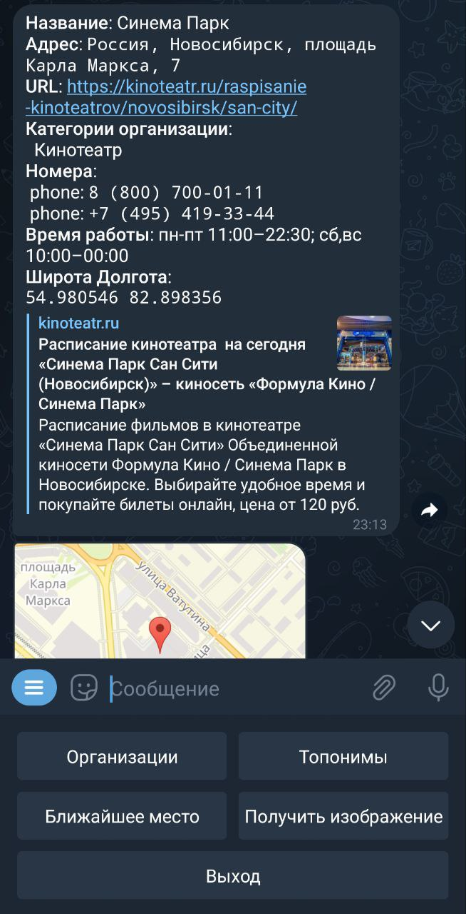
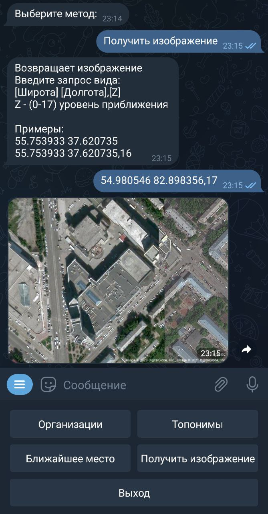
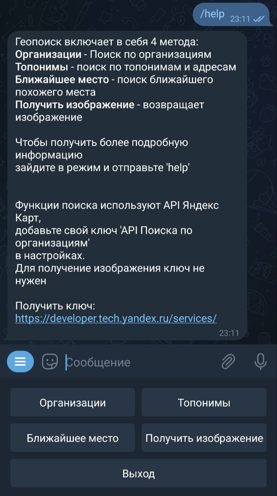

# Geosearch bot

![GitHub][license]

<hr>

`Geosearch bot` выполняет поиск организаций, топонимов и изображений.

Геопоиск включает в себя 4 метода:

* Организации - Поиск по организациям
* Топонимы - поиск по топонимам и адресам
* Ближайшее место - поиск ближайшего похожего места
* Получить изображение - возвращает изображение

Функции поиска используют API Яндекс Карт,
поэтому понадобиться ключ 'API Поиска по организациям'.
[Получить ключ](https://developer.tech.yandex.ru/services/)

Для получение изображения ключ не нужен

Зависимости:

* python 3.10
* aiogram 3.0.0b4
* aiosqlite 0.17.0
* ymaps 1.1
* python-dotenv 0.21.0

-----

## Установка:

1. Клонировать репозиторий и перейти в него в командной строке:
```sh
git clone https://github.com/sfkan6/geosearch_bot.git
```
```sh
cd geosearch_bot
```

2. Вставьте токен в .env:

.env
```sh 
TOKEN="your_bot_token"
```

### [Docker](https://docs.docker.com/get-docker/):

Создайте и запустите контейнер:
```sh
make docker
```

<details>
<summary>Запуск вручную</summary>

1. Создайте контейнер:
```sh
docker build -t geobot .
```

2. Запустите контейнер:
```sh
docker run --rm -it geobot
```

</details>

### Запуск:

Выполните в консоли:
```sh
make fast-run
```

<details>
<summary>Запуск вручную</summary>

1. Войдите в виртуальное окружение:
```sh
python -m venv venv
```

```sh
source venv/Scripts/activate
```
или
```sh
source venv/bin/activate
```

2. Установите зависимости:
```sh
pip install -r requirements.txt
```

3. Запустите:
```sh
python -m bot
```
 
</details>

## Systemd

1. Откройте и отредактируйте переменные WorkingDirectory и ExecStart в geosearch_bot.service;
2. Скопируйте файл службы в каталог /etc/systemd/system/
3. Активируйте сервис и запустите его:
```
sudo systemctl enable --now geosearch_bot
```
4. Проверьте статус сервиса:
```
systemctcl status geosearch_bot
```

<hr>



--------


--------


--------
## License

[MIT](https://choosealicense.com/licenses/mit/)

<!-- Badges -->

[license]: https://img.shields.io/github/license/sfkan6/ymaps
